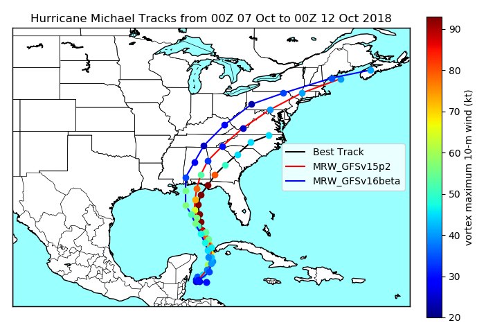

.. BarryCase documentation master file, created by
   sphinx-quickstart on Mon Jul  6 13:31:15 2020.
   You can adapt this file completely to your liking, but it should at least
   contain the root `toctree` directive.
.. raw:: html

    

.. role:: red
.. role:: green
.. role:: cyan
.. role:: purple
.. role:: blue
.. role:: yellow

2018 Hurricane Michael
=====================================

................................
Model Configuration and Datasets
................................

The case runs are initialized at 00z Oct 07, 2018 with 120 hours forecasting. The app uses ``./xmlchange`` to change the runtime settings. The settings that need to be modified to set up the start date, start time, and run time are listed below.

.. code-block:: bash
 
   ./xmlchange RUN_STARTDATE=2018-10-07,START_TOD=0,STOP_OPTION=nhours,STOP_N=120

Initial condition (IC) files are created from GFS operational dataset in NEMSIO format. The `Stand-alone Geophysical Fluid Dynamics Laboratory (GFDL) Vortex Tracker <https://dtcenter.org/community-code/gfdl-vortex-tracker>`_ is a tool to estimate hurricane tracks and intensities. The `BestTrack dataset <https://domain.invalid/>`_ provides the ‘truth’ data for hurricane evolution.

 .. container:: sphx-glr-footer
    :class: sphx-glr-footer-example

  .. container:: sphx-glr-download sphx-glr-download-python

     :download:`Download initial condition files: 2018100700.gfs.nemsio.tar.gz <https://domain.invalid/>`

..............
Case Results
..............

==============================
Hurricane Track and Intensity
==============================

  Hurricane tracks from MRW_GFSv16beta (red dashed line), MRW_GFSv15p2 (blue dashed line), and BestTrack (black dashed line). The dots are color coded with the vortex maximum 10-m wind speed (WS, kt). 

* MRW_GFSv16beta and MRW_GFSv15p2 generate left-of-track bias. 
* MRW_GFSv16beta and MRW_GFSv15p2 do not capture the hurricane intensities (represented by max WS), especially before the landfall.

  Time series of the vortex maximum surface wind speed (WS, left panel) and minimum mean sea level pressure (MSLP, right panel)

