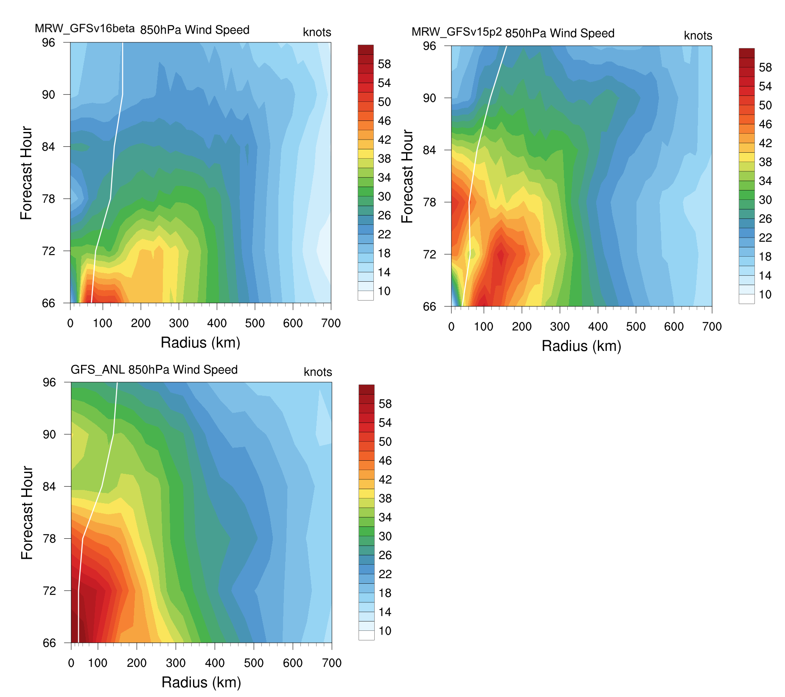

.. BarryCase documentation master file, created by
   sphinx-quickstart on Mon Jul  6 13:31:15 2020.
   You can adapt this file completely to your liking, but it should at least
   contain the root `toctree` directive.
.. raw:: html

    

.. role:: red
.. role:: green
.. role:: cyan
.. role:: purple
.. role:: blue
.. role:: yellow

2019 Hurricane Barry
=====================================

Hurricane Barry made landfall in Louisiana on July 11, 2019. The peak wind speed and minimum pressure reached 72 mph and 992 hPa, respectively during the storm. 

................................
Model Configuration and Datasets
................................

The UFS Medium-Range (MR) Weather Application (App) is used to prepare initial conditions, compile and run the UFS model, and post process the raw model outputs. Two model configuration compsets (``GFSv15p2`` and ``GFSv16beta``) are tested using the :emphasis:`C768` (~13km) spatial resolution with 64 vertical levels (default).

The case runs are initialized at 00z Jul 11, 2019 with 120 hours forecasting. The app uses ``./xmlchange`` to change the runtime settings. The settings that need to be modified to set up the start date, start time, and run time are listed below.

.. code-block:: bash
 
   ./xmlchange RUN_STARTDATE=2019-07-01,START_TOD=0,STOP_OPTION=nhours,STOP_N=120

Initial condition (IC) files are created from GFS operational dataset in NEMSIO format. The `Stand-alone Geophysical Fluid Dynamics Laboratory (GFDL) Vortex Tracker <https://dtcenter.org/community-code/gfdl-vortex-tracker>`_ is a tool to estimate hurricane tracks and intensities. The `BestTrack dataset <https://domain.invalid/>`_ provides the ‘truth’ data for hurricane evolution.

 .. container:: sphx-glr-footer
    :class: sphx-glr-footer-example

  .. container:: sphx-glr-download sphx-glr-download-python

     :download:`Download initial condition files: 2019071100.gfs.nemsio.tar.gz <https://domain.invalid/>`

..............
Case Results
..............

==============================
Hurricane Track and Intensity
==============================

  Hurricane tracks from GFSv16beta (red dash line), GFSv15p2 (blue dash line), and BestTrack (black dash line). The dots are color coded with the vortex maximum 10-m wind speed (WS, kt). 

* Both GFSv16beta and GFSv15p2 generate right-of-track bias. 
* Hurricane track and intensity simulated by GFSv15p2 are closer to BestTrack compared with GFSv16beta. 

  Time series of the vortex maximum surface wind speed (WS, left panel) and minimum mean sea level pressure (MSLP, right panel)

====================================
Comparison with Satellite Data
====================================

  Simulated outgoing longwave radiation (OLR) at the top of atmosphere (TOA) from GFSv16beta and GFSv15p2, and infrared images from `NASA Worldview <https://worldview.earthdata.nasa.gov/>`_ at the forecast hour of 72.

* Comparison with satellite product also indicates a right-of-track error
* Lower OLR near the tropical cyclone (TC) center suggests more clouds in GFSv15p2 than in GFSv16beta 

=============================================
Hovmöller diagram of 850 hPa WS after Landfall
=============================================

  Hovmöller diagram of wind speed and 850 hPa and the radius of maximum wind (RMW, white line) after landfall

* The low-level wind speed in GFS model is smaller than GFS_ANL
* The GFSv16beta has the largest inner core size. GFS15p2 has similar inner core sizes and GFS_ANL 
* Hurricane intensity attenuates faster in the model compared with BestTrack after landfall 

