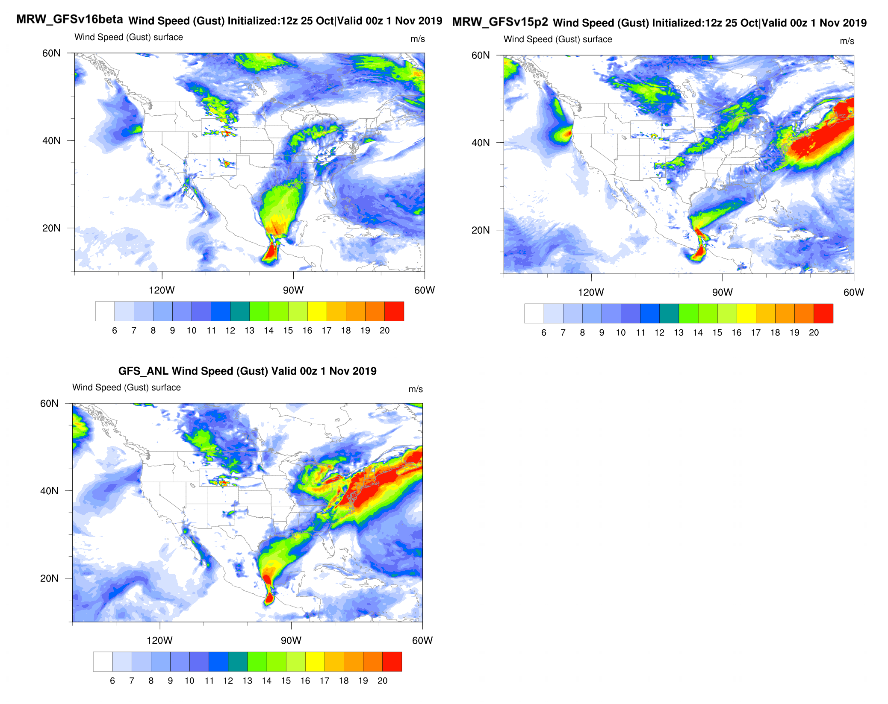
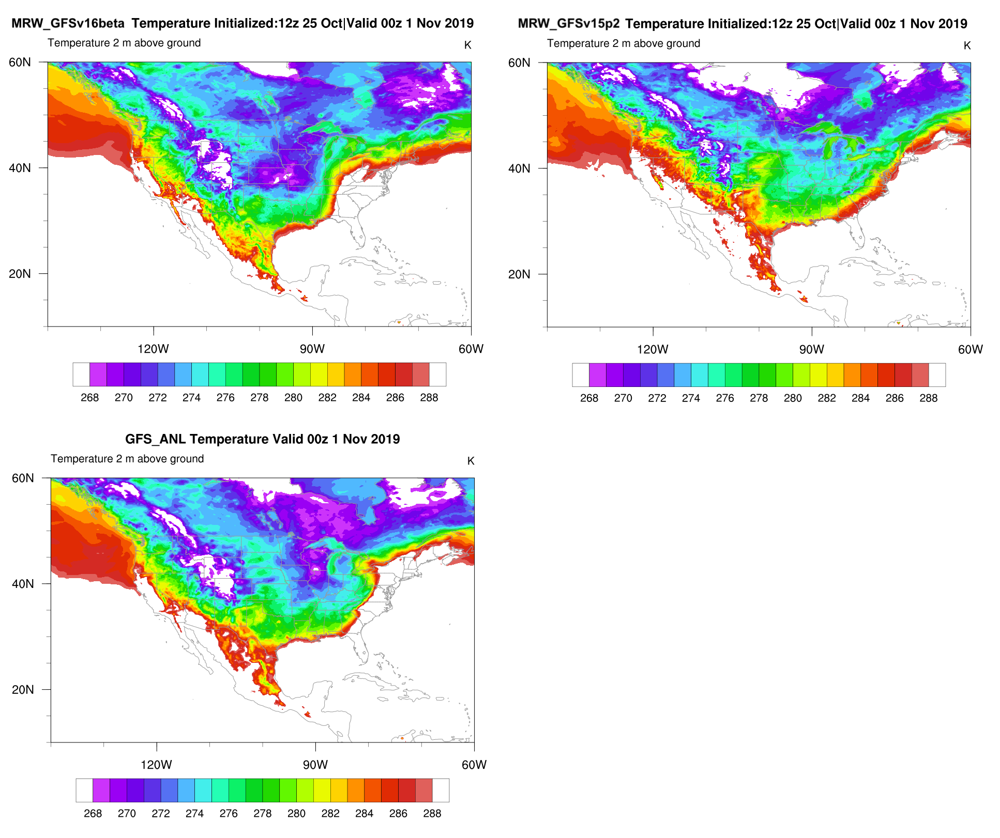
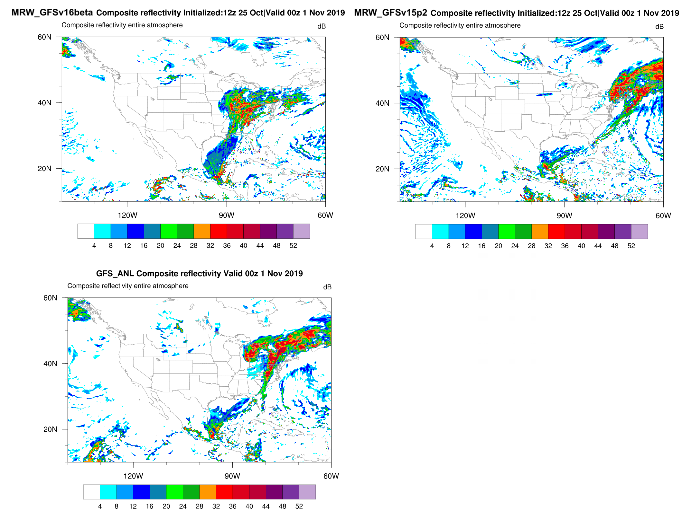

.. BarryCase documentation master file, created by
   sphinx-quickstart on Mon Jul  6 13:31:15 2020.
   You can adapt this file completely to your liking, but it should at least
   contain the root `toctree` directive.

2019 Halloween Storm
=====================================

The 2019 Halloween storm stroke the eastern U.S. cities with wind gusts, thunderstorms, and flash flooding. 

..............................
Model Configuration and Datasets
..............................

The case runs are initialized at 12z Oct 25, 2019 with 120 hours forecasting. The corresponding namelist options that need to be changed are listed below. The app uses ``./xmlchange`` to change the runtime settings. The settings that need to be modified to set up the start date, start time, and run time are listed below.

.. code-block:: bash
 
   ./xmlchange RUN_STARTDATE=20191025,START_TOD=43200,STOP_OPTION=nhours,STOP_N=120

.. warning:: The model run time step is reduced from the default 225s to 150s in this case due to the model instability in GFSv16beta. To set the time step, add ``dt_atmos=150`` to ``user_nl_ufsatm``

Initial condition (IC) files are created from GFS operational dataset in NEMSIO format. The `GFS reanalysis dataset <https://www.ncdc.noaa.gov/data-access/model-data/model-datasets/global-forcast-system-gfs>`_ are used as 'truth' to compare with simulation results.

 .. container:: sphx-glr-footer
    :class: sphx-glr-footer-example

  .. container:: sphx-glr-download sphx-glr-download-python

     :download:`Download initial condition files: 2019102512.gfs.nemsio.tar.gz <https://domain.invalid/>`
..............
Case Results
..............

======================================================
500 mb Geopotential Height and Absolute Vorticity Map
======================================================

  500 hPa geopotential heights (dam), absolute vorticity (10 :sup:`-5`/s), and winds (m/s)

* GFSv15p2 generates a progressive synoptic pattern compared with reanalysis data. 
* GFSv16beta alleviates the progressiveness of synoptic pattern.

====================================
Surface Gust and 2-m Temperature
====================================

  Surface gust (m/s) valid at 00z 1 Nov 2019

* GFSv15p2 captures the magnitudes of surface gust in GFS_ANL. 
* GFSv16beta does not reach the peak of surface gust in GFS_ANL. 
  

  2-m temperature (K) valid at 00z 1 Nov 2019 

* Colder 2-m T in GFSv15p2 along the U.S. east coast compared with GFS_ANL
* Colder 2-m T at northern east coast and warmer 2-m T at southern east coast in GFSv16beta

====================================
Composite Reflectivity
====================================

  Composite reflectivity (dB)
