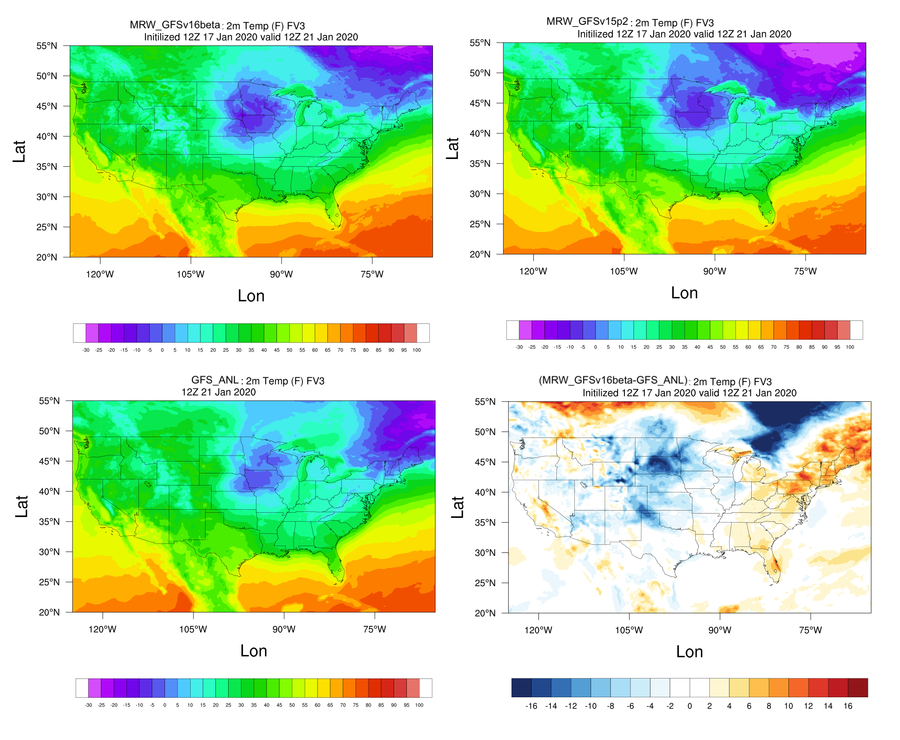

.. BarryCase documentation master file, created by
   sphinx-quickstart on Mon Jul  6 13:31:15 2020.
   You can adapt this file completely to your liking, but it should at least
   contain the root `toctree` directive.

2020 January Cold Bias
=====================================
  
..............................
Model Configuration and Datasets
..............................

The case runs are initialized at 12z Jan 17, 2020 with 120 hours forecasting. The corresponding namelist options that need to be changed are listed below. The app uses ``./xmlchange`` to change the runtime settings. The settings that need to be modified to set up the start date, start time, and run time are listed below.

.. code-block:: bash
 
   ./xmlchange RUN_STARTDATE=2020-01-17,START_TOD=43200,STOP_OPTION=nhours,STOP_N=120

Initial condition (IC) files are created from GFS operational dataset in NEMSIO format. The `GFS reanalysis dataset <https://www.ncdc.noaa.gov/data-access/model-data/model-datasets/global-forcast-system-gfs>`_ are used as 'truth' to compare with simulation results.

 .. container:: sphx-glr-footer
    :class: sphx-glr-footer-example

  .. container:: sphx-glr-download sphx-glr-download-python

     :download:`Download initial condition files: 2020011712.gfs.nemsio.tar.gz <https://domain.invalid/>`

..............
Case Results
..............

======================================================
2-m Temperature
======================================================

  2-m temperature (K) from GFSv16beta (upper left), GFSv15p2 (upper right), GFS_ANL (lower left), and difference between GFSv16beta and GFS_ANL (lower right)
