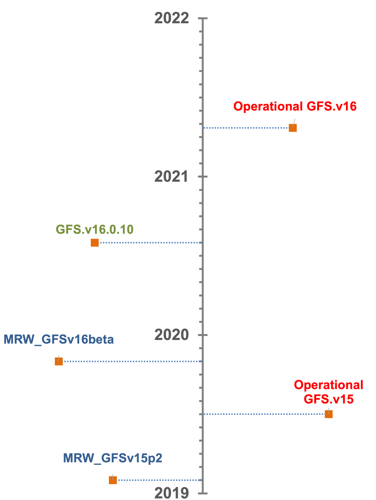

.. BarryCase documentation master file, created by
   sphinx-quickstart on Mon Jul  6 13:31:15 2020.
   You can adapt this file completely to your liking, but it should at least
   contain the root `toctree` directive.

Introduction
=====================================

Challenges for accurate weather predictions still exist in numerical models. To facilitate the development and improvement of the NOAA operational model, NOAA's Global Forecast System (GFS) is shared with the broad community through the `Unified Forecast System (UFS) <https://ufscommunity.org/>`_ applications. The UFS Medium-Range Weather (MRW) Application (App) provides the source code of GFS, including physics schemes for GFS version 15 (CompSet ``GFS.v15p2``) and additional developmental schemes for GFS version 16 (CompSet ``GFS.v16beta``). The most up-to-date source codes for GFS.v16 can be accessed from the `ufs-weather-model <https://github.com/ufs-community/ufs-weather-model>`_ GitHub repository. The UFS Short-Range Weather (SRW) Application (App) is the a limited area version for the UFS, including physics schemes for  The UFS Short-Range Weather (SRW) Application (App) is the a limited area version for the UFS, including physics schemes for ``GFS.v15p2`` and ``RRFS.v1alpha``. GFS.v15 went into operations in June 2019, the operational implementation fo GFS.v16 is currently planned for February 2021 (`Yang 2020 <https://ufscommunity.org/wp-content/uploads/2020/10/UFS_Webnair_GFSv16_20201022_FanglinYang.pdf>`_). The known biases and development priorities related to GFS.v15 (`Stan et al. 2019 <https://drive.google.com/file/d/1rdFPbY28d7cRrcShy0uo4Mtqwh3BSzYg/view>`_) and GFS.v16 (recently presented by `Yang 2020 <https://ufscommunity.org/wp-content/uploads/2020/10/UFS_Webnair_GFSv16_20201022_FanglinYang.pdf>`_) have been identified and listed below. The knowing bugs in SRW App 1.0 can be found at `SRW App website <https://github.com/ufs-community/ufs-srweather-app/wiki/Release-Notes-and-Known-Bugs>`_. 

.. tabs::
  .. group-tab:: GFS.v15 

    - Less skillful hurricane track forecasts for strong storms in the Atlantic basin
    - Progressive with synoptic patterns
    - Extreme 2-m temperature biases in the mid-west region in the warm season
    - Cold bias in the lower troposphere and near the surface in the winter season
    - Precipitation dry bias for moderate rainfall
    - Struggle to capture boundary layer inversions    
  .. group-tab:: GFS.v16

    - Increased right-of-track bias for tropical cyclones (TC) at longer lead times at North Atlantic
    - Larger TC False Alarm Rate in the western North Atlantic
    - Exacerbated low instability bias, which is largely related to dry soil moisture
    - Poor representation of radiation inversions
  .. group-tab:: RRFS.v1alpha

    - Better hurricane track forecasts for strong storms in the Atlantic basin
    - Weak hurricane intensity forecasts
    - Unstable signal over mountain area
    - Slightly better cold air damming signal
    - The heat wave signal is too strong
   
This document provides case studies evaluation results for GFS using the `UFS Medium Range Weather (MRW) App <https://ufs-mrweather-app.readthedocs.io/en/latest/index.html>`_ with the target audience being a broad community. These cases are also run using the NOAA Environmental Model Center (EMC) `Global Workflow <https://github.com/NOAA-EMC/global-workflow/wiki>`_, which points to the most up-to-date GFS codes, and are expected to provide insights for the on-going model development. Brief descriptions for MRW App and Global Workflow are below. 

.. tabs::
  .. group-tab:: Medium-Range Weather (MRW) App 

	The `UFS Medium Range Weather (MRW) App <https://ufs-mrweather-app.readthedocs.io/en/latest/index.html>`_ uses the `Common Infrastructure for Modeling the Earth (CIME) workflow <https://esmci.github.io/cime/versions/ufs_release_v1.0/html/index.html>`_ that incorporates pre-processing software, forecast model, and post-processor. The app serves as a useful tool to conduct the UFS WM runs. The latest evaluation results are based on physics compsets of ``GFSv15p2`` and ``GFSv16beta`` employed in UFS Medium Range Weather App *v1.0* (MRW.v1.0), hereafter referred to as MRW_GFSv15p2 and MRW_GFSv16beta, respectively.
  
  .. group-tab:: Global Workflow

	The `Global Workflow <https://github.com/NOAA-EMC/global-workflow>`_ developed by `NOAA EMC <https://www.emc.ncep.noaa.gov/emc_new.php>`_ is a superstructure that supports the Finite-Volume on a Cubed-Sphere Global Forecast System (FV3GFS) development. It includes submodules that points to the most up-to-date GFS model development codes located in the `ufs-weather-model <https://github.com/ufs-community/ufs-weather-model>`_ GitHub repository. Case study results are continually updated when substantial physics innovations are included and GitHub tags (e.g., ``GFS.v16.0.10``) are created between two subsequent public releases.

  .. group-tab:: Short-Range Weather (SRW) App 

	The `UFS Short Range Weather (SRW) App <https://ufs-srweather-app.readthedocs.io/en/latest/index.html>`_ uses the `regional workflow` that incorporates pre-processing software, forecast model, and post-processor. The app serves as a useful tool to conduct the UFS WM runs. The latest evaluation results are based on physics compsets of ``GFSv15p2`` and ``RRFSv1alpha`` employed in UFS Short Range Weather App *v1.0* (SRW.v1.0), hereafter referred to as SRW_GFSv15p2 and SRW_RRFSv1alpha, respectively.
  
The goal of this ongoing effort is to provide the community, as well as the physics development team, with a model testing platform where they can use the resources to conduct model runs and evaluate the model performance for representative meteorological cases. These case studies will provide insights for future model developments and aim at improving NOAA numerical weather forecasts. It should be noted that this is an ongoing effort that is aligned with the model public release and model development. Namely these evaluation results only apply to specific model versions. Timeline of physics frozen date in different model versions, including both UFS MRW/SRW APP CompSets and ufs-weather-model GitHub tags, are shown below:

   Timeline of physics frozen date

The case catalogue in this documentation are created based on the known biases of GFS model. This is a list that we are updating diligently. Please come back to check updates anytime.

**References**

Stan C., Yang F., and Harris L. (2019). UFS Development Goals and Priorities for Medium-Range and S2S Applications. *Unified Forecast System Community*. [`Link <https://drive.google.com/file/d/1rdFPbY28d7cRrcShy0uo4Mtqwh3BSzYg/view>`_]

Yang F. (2020). Development and evaluation of NCEP's Global Forecast System Version 16. *Unified Forecast System Community Webinar*, Oct 22, 2020. [`Link <https://ufscommunity.org/wp-content/uploads/2020/10/UFS_Webnair_GFSv16_20201022_FanglinYang.pdf>`_]

