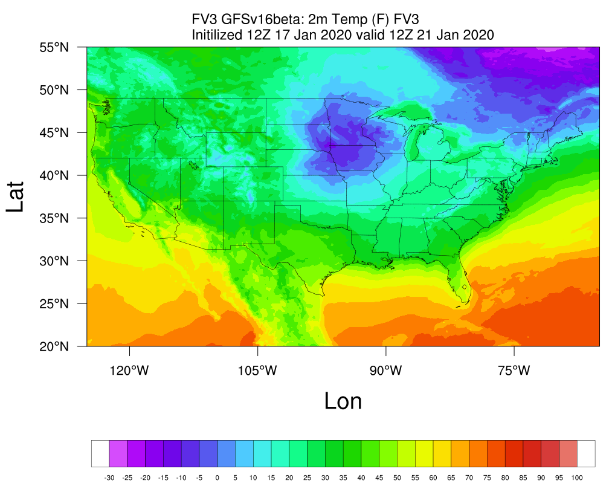

.. only:: html

    .. note::
        :class: sphx-glr-download-link-note

        Click :ref:`here <sphx_glr_download_auto_examples_Spatial_2m_T.py>`     to download the full example code
    .. rst-class:: sphx-glr-example-title

    .. _sphx_glr_auto_examples_Spatial_2m_T.py:

Plotting Spatial Map of 2-m Temperature
==========================================

This example plots the spatial distribution of 2-m temperature from UFS MRW outputs.

.. code-block:: default

    import Ngl, Nio
    import pandas as pd
    import numpy as np
    import xarray as xr
    import netCDF4 as nc
    from netCDF4 import Dataset
    import matplotlib.pyplot as plt

    # Read in NetCDF data
    fv3=nc.MFDataset('GFSv16veta/GFSPRS.GrbF96.nc')
    tmp2m=fv3["TMP_2maboveground"][0,:,:]
    tmp2mF=(tmp2m-273.15)*9/5+32
    lat=fv3["latitude"]
    lon=fv3["longitude"]

    # Read in NetCDF data
    wks_type = "png"
    wks = Ngl.open_wks(wks_type,"FV3_T2_20200121_1200_MRW_GFSv16beta")
    cnres                 = Ngl.Resources()

    # Contour resources
    cnres.cnFillOn        = True
    cnres.cnFillPalette   = "NCV_bright_white"
    cnres.cnLinesOn       = False
    cnres.cnLineLabelsOn  = False
    cnres.cnLevelSelectionMode = "ManualLevels"
    cnres.cnMinLevelValF = -30
    cnres.cnMaxLevelValF = 100
    cnres.nglMaximize = True
    cnres.tiXAxisString = "Lon"
    cnres.tiYAxisString = "Lat"
    cnres.lbOrientation   = "horizontal"

    # Scalar field resources
    cnres.sfXArray        = lon[:]
    cnres.sfYArray        = lat[:]

    # Map resources
    cnres.mpFillOn               = False
    cnres.mpGridAndLimbOn = False
    cnres.mpLandFillColor        = "Transparent"
    cnres.mpOceanFillColor       = "Transparent"
    cnres.mpInlandWaterFillColor = "Transparent"
    cnres.mpLimitMode        = "LatLon"

    # Map region
    cnres.mpMaxLonF = -65
    cnres.mpMaxLatF = 55
    cnres.mpMinLonF = -125
    cnres.mpMinLatF = 20
    cnres.mpDataBaseVersion     = "MediumRes"
    cnres.mpOutlineBoundarySets = "USStates"

    # Plot resources
    cnres0=cnres
    cnres0.tiMainString = "MRW_GFSv16beta: 2m Temp (F) FV3 ~C~Initialized 12Z 17 Jan 2020 valid 12Z 21 Jan 2020"#"{} ({}) at {:.2f} hPa with fast_sat".format(clwmr.long_name,clwmr.units,vpfull)
    cnres0.tiMainFontHeightF=0.012
    contour = Ngl.contour_map(wks,tmp2mF[:,:],cnres0)

    # Draw the plot
    Ngl.draw(contour)
    Ngl.end()

.. _sphx_glr_download_auto_examples_Spatial_2m_T.py:

.. only :: html

 .. container:: sphx-glr-footer
    :class: sphx-glr-footer-example

  .. container:: sphx-glr-download sphx-glr-download-python

     :download:`Download Python source code: Spatial_2m_T.py <../examples/Spatial_2m_T.py>`

  .. container:: sphx-glr-download sphx-glr-download-jupyter

     :download:`Download Jupyter notebook: Spatial_2m_T.ipynb <../examples/Spatial_2m_T.ipynb>`

.. only:: html

 .. rst-class:: sphx-glr-signature

    `Gallery generated by Sphinx-Gallery <https://sphinx-gallery.github.io>`_
