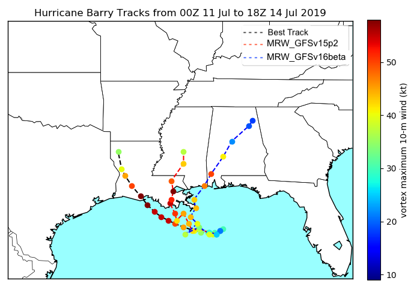

.. only:: html

    .. note::
        :class: sphx-glr-download-link-note

        Click :ref:`here <sphx_glr_download_auto_examples_TC_Tracks_Intensity.py>`     to download the full example code
    .. rst-class:: sphx-glr-example-title

    .. _sphx_glr_auto_examples_TC_Tracks_Intensity.py:

Plotting Hurricane Track and Intensity Map
==========================================

This example plots the hurricane tracks and intensity estimated from tc-tracker as well as the BestTrack data.

.. code-block:: default

    from matplotlib import pyplot as plt
    from mpl_toolkits.basemap import Basemap
    import numpy as np
    import matplotlib.cm as cm
    import matplotlib.colors as co
    import matplotlib

    # Define map
    m = Basemap(projection='cyl', \
            llcrnrlat= 25, urcrnrlat= 40, \
            llcrnrlon= -100, urcrnrlon= -80, \
            resolution='l')

    # Define plot size
    fig, ax = plt.subplots(figsize=(8,8))

    # Read GFSv15p2 vortext tracker results
    csv_file = "GFSv15p2/fort.69"
    tc = np.recfromcsv(csv_file, unpack=True, names=['stormid', 'count', 'initdate', 'constant', 'atcf', 'leadtime', 'lat','lon','ws','mslp','placehoder', 'thresh', 'neq', 'blank1', 'blank2', 'blank3','blank4','blank5','blank6','blank7'], dtype=None)

    # Read GFSv16beta vortext tracker results
    csv_file2 = "16beta/fort.69"
    tc2 = np.recfromcsv(csv_file2, unpack=True, names=['stormid', 'count', 'initdate', 'constant', 'atcf', 'leadtime', 'lat','lon','ws','mslp','placehoder', 'thresh', 'neq', 'blank1', 'blank2', 'blank3','blank4','blank5','blank6','blank7'], dtype=None)

    # Read BestTrack data
    bal_file ="BestTrack/bal022019_post.dat"
    bal = np.recfromcsv(bal_file,unpack=True,delimiter=",",usecols=[0,2,6,7,8,9,10,11],names=['stormid','time','lat','lon','ws','mslp','intens','thresh'],dtype=None)

    # Initialize blank lists
    xs1 = []
    ys1 = []
    xs2 = []
    ys2 = []

    xs12 = []
    ys12 = []
    xs22 = []
    ys22 = []

    tclon =[]
    tclat=[]
    ws=[]
    bxs1 = []
    bys1 = []
    ballon=[]
    ballat=[]

    # Prepare color map based on vortex center maximum wind speed   
    cmap=plt.cm.jet
    norm=co.Normalize(vmin=9,vmax=55)
    colors=plt.cm.ScalarMappable(norm,cmap)
    col=colors.to_rgba(tc.ws)
    bcol=colors.to_rgba(bal.ws)
    col2=colors.to_rgba(tc2.ws)

    # Read the vortex center, lat and lon, from BestTrack data  
    for k in range(len(bal.lat)):
        if bal.thresh[k] == 34 or bal.thresh[k] == 0:
            ballon=float(bal.lon[k][1:5])*0.1*(-1)
            ballat=float(bal.lat[k][1:4])*0.1
            lonn,latt=ballon,ballat
            xptt,yptt=m(lonn,latt)
            lonptt,latptt=m(xptt,yptt,inverse=True)
            bxs1.append(lonn)
            bys1.append(latt)
    cs1=m.plot(bxs1, bys1, linestyle='--',color='Black',label='BestTrack')   

    # Read the vortex center, lat and lon, from BestTrack data to make colored dots along with the tracks  
    bxs1 = []
    bys1 = []
    ballon=[]
    ballat=[]
    count=0
    for k in range(len(bal.lat)):
        if bal.thresh[k] == 34 or bal.thresh[k] == 0:
            ballon=float(bal.lon[k][1:5])*0.1*(-1)
            ballat=float(bal.lat[k][1:4])*0.1
            lonn,latt=ballon,ballat
            xptt,yptt=m(lonn,latt)
            lonptt,latptt=m(xptt,yptt,inverse=True)
            bxs1.append(lonn)
            bys1.append(latt)
            m.plot(bxs1[count], bys1[count], marker='o',color=bcol[k,:])
            count=count+1                     
    encoding='utf-8'

    # Read the vortex center, lat and lon, from tc-tracker results for GFSv15p2   
    for j in range(len(tc.ws)):
        tcstormid=str(tc.stormid[j],encoding)
        print(tcstormid)
        if tcstormid=='AL' and tc.count[j]== 2 and tc.thresh[j]==34 and tc.leadtime[j]<=9000:
            tclon=float(tc.lon[j][1:5])*0.1*(-1)
            tclat=float(tc.lat[j][1:4])*0.1
            lon, lat = tclon, tclat
            xpt, ypt = m(lon, lat)
            lonpt, latpt = m(xpt, ypt, inverse=True)
            xs1.append(lon)
            ys1.append(lat)  
    cs2=m.plot(xs1, ys1, linestyle='--',color='Red',label='UFSv1.0.0_15p2_hybedmf')

    # Read the vortex center, lat and lon, from tc-tracker results for GFSv15p2 to make colored dots along with the tracks  
    xs1 = []
    ys1 = []
    xs2 = []
    ys2 = []
    tclon =[]
    tclat=[]
    count=0
    for j in range(len(tc.ws)):
        tcstormid=str(tc.stormid[j],encoding)
        if tcstormid=='AL' and tc.count[j]==2 and tc.thresh[j]==34 and tc.leadtime[j]<=9000:
            tclon=float(tc.lon[j][1:5])*0.1*(-1)
            tclat=float(tc.lat[j][1:4])*0.1
            lon, lat = tclon, tclat
            xpt, ypt = m(lon, lat)
            lonpt, latpt = m(xpt, ypt, inverse=True)
            xs1.append(lon)
            ys1.append(lat)
            m.plot(xs1[count], ys1[count], marker='o',color=col[j,:])
            count=count+1
            print(count) 

    # Read the vortex center, lat and lon, from tc-tracker results for GFSv16beta 
    for j in range(len(tc2.ws)):
        tc2stormid=str(tc2.stormid[j],encoding)
        print(tc2stormid)
        if tc2stormid=='AL' and tc2.count[j]== 2 and tc2.thresh[j]==34 and tc2.leadtime[j]<=9000:
            tc2lon=float(tc2.lon[j][1:5])*0.1*(-1)
            tc2lat=float(tc2.lat[j][1:4])*0.1
            lon2, lat2 = tc2lon, tc2lat
            xpt2, ypt2 = m(lon2, lat2)
            lonpt2, latpt2 = m(xpt2, ypt2, inverse=True)
            xs12.append(lon2)
            ys12.append(lat2)  
    cs22=m.plot(xs12, ys12, linestyle='--',color='Blue',label='UFSv1.0.0_16beta')

    # Read the vortex center, lat and lon, from tc-tracker results for GFSv16beta to make colored dots along with the tracks 
    xs12 = []
    ys12 = []
    xs22 = []
    ys22 = []
    tc2lon =[]
    tc2lat=[]
    count2=0
    for j in range(len(tc2.ws)-1):
        tc2stormid=str(tc2.stormid[j],encoding)
        if tc2stormid=='AL' and tc2.count[j]==2 and tc2.thresh[j]==34 and tc2.leadtime[j]<=9000:
            tc2lon=float(tc2.lon[j][1:5])*0.1*(-1)
            tc2lat=float(tc2.lat[j][1:4])*0.1
            lon2, lat2 = tc2lon, tc2lat
            xpt2, ypt2 = m(lon2, lat2)
            lonpt2, latpt2 = m(xpt2, ypt2, inverse=True)
            xs12.append(lon2)
            ys12.append(lat2)
            m.plot(xs12[count2], ys12[count2], marker='o',color=col2[j,:])
            count2=count2+1

    # Draw coastline
    m.drawcoastlines()
    m.drawcountries()
    m.drawstates()
    m.drawmapboundary(fill_color='#99ffff')
    m.fillcontinents(color='white',lake_color='#99ffff')
    colors.set_array([])

    # Show and save the plot
    plt.legend()
    plt.title('Hurricane Barry Tracks from 00Z 11 Jul to 18Z 14 Jul 2019')
    plt.colorbar(colors,fraction=0.035,pad=0.04,label='vortex maximum 10-m wind (kt)')
    plt.show()
    plt.savefig('Tracker_Barry_ufsv1.png')

.. rst-class:: sphx-glr-timing

   **Total running time of the script:** ( 0 minutes  0.000 seconds)

.. _sphx_glr_download_auto_examples_TC_Tracks_Intensity.py:

.. only :: html

 .. container:: sphx-glr-footer
    :class: sphx-glr-footer-example

  .. container:: sphx-glr-download sphx-glr-download-python

     :download:`Download Python source code: TC_Tracks_Intensity.py <TC_Tracks_Intensity.py>`

  .. container:: sphx-glr-download sphx-glr-download-jupyter

     :download:`Download Jupyter notebook: TC_Tracks_Intensity.ipynb <TC_Tracks_Intensity.ipynb>`

.. only:: html

 .. rst-class:: sphx-glr-signature

    `Gallery generated by Sphinx-Gallery <https://sphinx-gallery.github.io>`_
