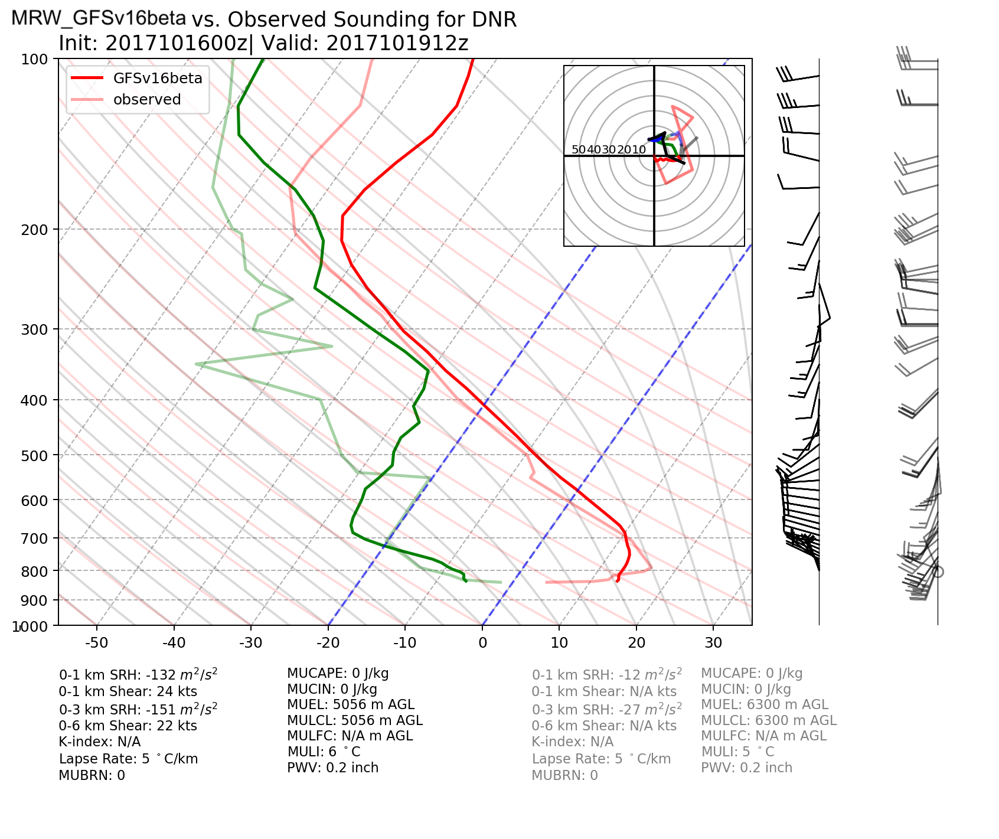

.. BarryCase documentation master file, created by
   sphinx-quickstart on Mon Jul  6 13:31:15 2020.
   You can adapt this file completely to your liking, but it should at least
   contain the root `toctree` directive.

Welcome to the Case Studies Page for the UFS Weather Model
=======================================================

This documentation provides resources for representative case studies in the Unified Forecast System (UFS) Weather model using `UFS Medium-Range Weather Application <https://ufs-mrweather-app.readthedocs.io/en/latest/index.html>`_ (for community) and NOAA Environmental Modeling Center's `Global Workflow <https://github.com/NOAA-EMC/global-workflow/wiki>`_ (for developers).

.. |logo1| image:: images/2019Barry/tracker_Barry_ufsv1.png  
   :width: 300
   :align: middle

.. |logo2| image:: images/2020JanCold/Diff_FV3_T2_20200121_1200_GFSv16beta.png
   :width: 300
   :align: top

+---------+---------+---------+
| |logo1| | |logo2| | |logo3| |
+---------+---------+---------+

.. tabs::
  .. group-tab:: Medium-Range Weather (MRW) App 

    :GitHub: `ufs-community/ufs-mrweather-app <https://github.com/ufs-community/ufs-mrweather-app>`_
    :Public Release:  *v1.0*
    :Compsets:  ``GFSv16beta``, ``GFSv15p2``
  .. group-tab:: Global Workflow

    :GitHub: `NOAA-EMC/global-workflow <https://github.com/NOAA-EMC/global-workflow>`_
    :Branch:  *feature/gfs16b*
    :ufs-weather-model: ``GFS.v16.0.10`` 

:Case Catalog:
  * :ref:`2018 Hurricane Michael <2018 Hurricane Michael>`
  * :ref:`2019 Hurricane Barry <2019 Hurricane Barry>`
  * :ref:`2019 Halloween Storm <2019 Halloween Storm>`
  * :ref:`2020 Easter Sunday Storm <2020 Easter Sunday Storm>`
  * :ref:`2019 Memorial Day Heat Wave <2019 Memorial Day Heat Wave>`
  * :ref:`2020 January Cold Bias <2020 January Cold Bias>`
  * :ref:`2017 Denver Inversion <2017 Denver Inversion>`
:Date of last update:  |today|

..............................
Notable Links
..............................

* `Key foci for UFS of Medium-Range/Subseasonal-to-Seasonal scale research and development (from UFS-R2O Roject) <https://www.weather.gov/media/sti/UFS-R2O-Project-Proposal-Public.pdf>`_
* `Developmental Testbed Center (DTC) <https://www.dtcenter.org/>`_
* `Unified Forecast System (UFS) <https://ufscommunity.org/>`_
* `The UFS Medium-Range Weather App Users Guide <https://ufs-mrweather-app.readthedocs.io/en/latest/index.html>`_
* `NOAA Environmental Modeling Center (EMC) global-workflow GitHub Wiki page <https://github.com/NOAA-EMC/global-workflow/wiki>`_

..............................
Contents
..............................

.. toctree::
   :numbered:
   :maxdepth: 3
   
   Intro.rst
   2018Michael.rst
   2019Barry.rst
   2019HaloweenStorm.rst
   2020EasterStorm.rst
   2019MemHeat.rst
   2020ColdBias.rst
   2017DenverPBL.rst
   example.rst

