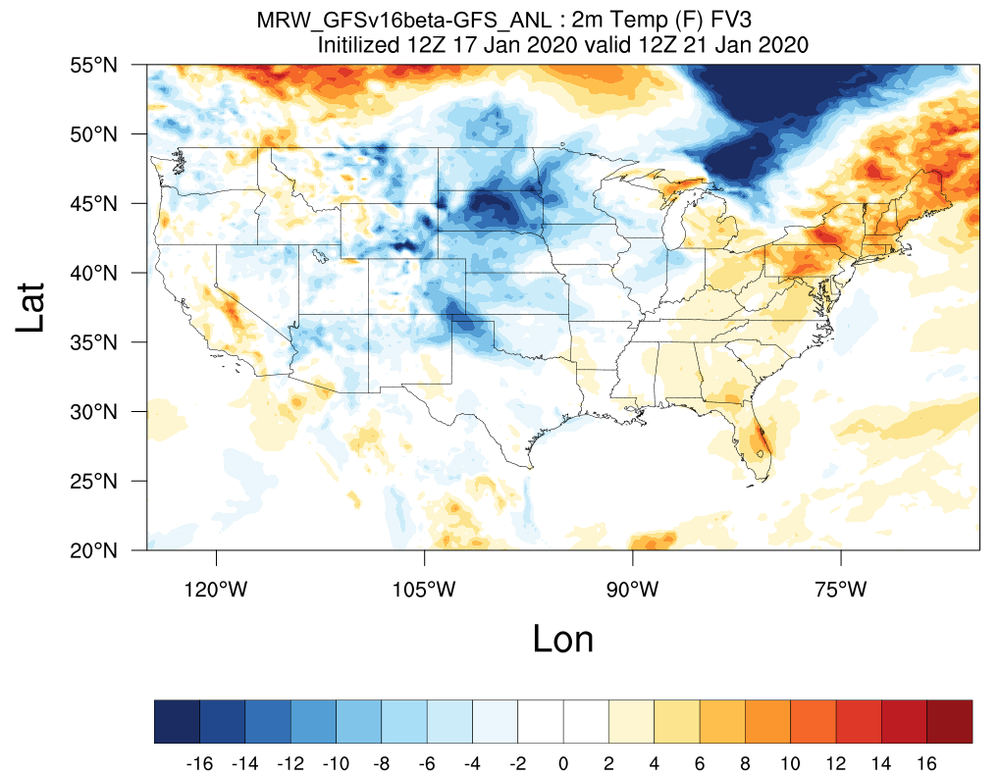

.. BarryCase documentation master file, created by
   sphinx-quickstart on Mon Jul  6 13:31:15 2020.
   You can adapt this file completely to your liking, but it should at least
   contain the root `toctree` directive.

Welcome to the Test Cases Page for the UFS weather model
=======================================================

.. |logo1| image:: images/tracker_Barry_ufsv1.png  
   :width: 300
   :align: middle

+---------+---------+---------+
| |logo1| | |logo2| | |logo3| |
+---------+---------+---------+

:Release:  *ufs-v1.0*
:Compsets:  ``GFSv16beta``, ``GFSv15p2``
:Date:  |today|  
:Case Catalog:
  * :ref:`2019 Hurricane Barry <2019 Hurricane Barry>`
  * :ref:`2018 Hurricane Michael <2018 Hurricane Michael>`
  * :ref:`2019 Halloween Storm <2019 Halloween Storm>`
  * :ref:`2017 Denver Inversion <2017 Denver Inversion>`
  * :ref:`2020 January Cold Bias <2020 January Cold Bias>`
  
This documentation provides resources for representative case studies in the Unified Forecast System Weather model.

..............................
Notable Links
..............................

* `Developmental Testbed Center (DTC) <https://www.dtcenter.org/>`_
* `Unified Forecast System (UFS) <https://ufscommunity.org/>`_
* `The UFS Medium-Range Weather App Users Guide <https://ufs-mrweather-app.readthedocs.io/en/latest/index.html>`_
* `Current known biases of UFS <https://drive.google.com/file/d/1rdFPbY28d7cRrcShy0uo4Mtqwh3BSzYg/view>`_

..............................
Contents
..............................

.. toctree::
   :numbered:
   :maxdepth: 3
   
   Intro.rst
   2019Barry.rst
   2018Michael.rst
   2019Haloween.rst
   2017DenverPBL.rst
   2020ColdBias.rst
   example.rst

