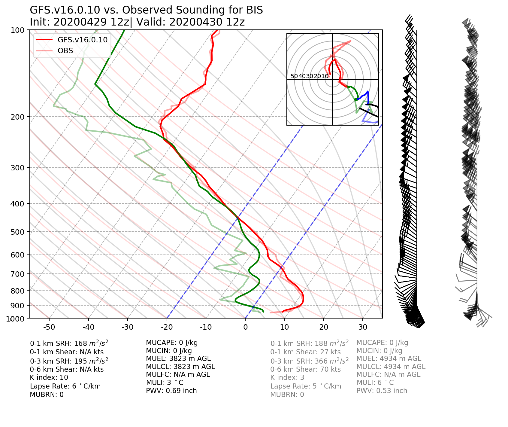

.. BarryCase documentation master file, created by
   sphinx-quickstart on Mon Jul  6 13:31:15 2020.
   You can adapt this file completely to your liking, but it should at least
   contain the root `toctree` directive.

The Case Study with the UFS Short-Range Weather Application 
=======================================================

This documentation provides resources for representative case studies in the Unified Forecast System (UFS) Weather model using `UFS Short-Range Weather Application <https://ufs-mrweather-app.readthedocs.io/en/latest/index.html>`_ (for community) and NOAA Environmental Modeling Center's `Global Workflow <https://github.com/NOAA-EMC/global-workflow/wiki>`_ (for developers).

.. |logo1| image:: images/2019Barry/tracker_Barry_ufsv1.png  
   :width: 300
   :align: middle

.. |logo2| image:: images/2020JanCold/Diff_FV3_T2_20200121_1200_GFSv16beta.png
   :width: 300
   :align: top

+---------+---------+---------+
| |logo1| | |logo2| | |logo3| |
+---------+---------+---------+

.. tabs::
  .. group-tab:: Short-Range Weather (SRW) App 

    :GitHub: `ufs-community/ufs-mrweather-app <https://github.com/ufs-community/ufs-mrweather-app>`_
    :Public Release:  *v1.0*
    :Compsets:  ``GFSv16beta``, ``GFSv15p2``

..............................
Contents
..............................

.. toctree::
   :numbered:
   :maxdepth: 3
   
   2020CAD_srw.rst

